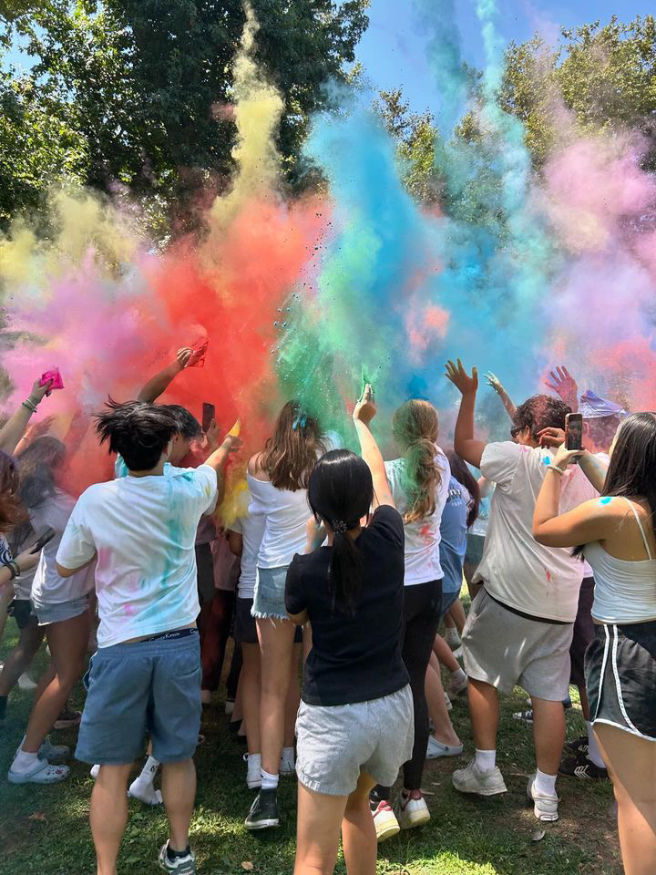
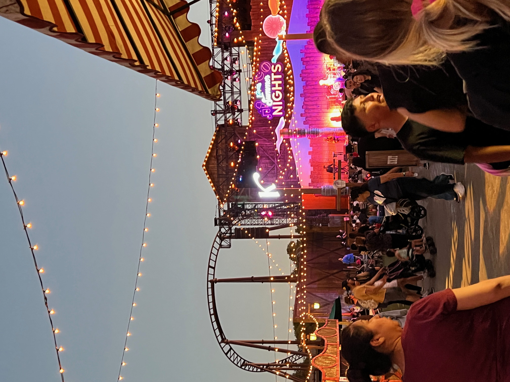

# Summer 2024 -- Kristy

## Who am I?
My name is **Kirsty W** and I am in 10th grade. Im really excited to make new friends this year and hangout with my old ones. I love the color pink and elephants. Fun fact, my name actually means *ivory* in Thai. My birthday is November 26, that's why I consider the number 26 as my lucky number. I hope that this year will be full of new oppertunities and amazing memories.

## What are my Goals?
I have big plans for this school year. Of course, as always, I plan on doing my best to maintain my 4.0 GPA. I also want to get at least 3's on all my AP tests. Besides school, I want to joing and particapte in more club events. For example, I will be joining **MUN** this year. I am also working on my speech for when I run to become *LTG* for **Key Club**. I hope that I can do my best to acomplish all of my plans.

## Giving Back to the Community
This summer, I participated in many community service events through **Key Club**. Every month, Key Club hosts a *DCM* which has a small service project that allows you to gain hours. I am actually in charge of planning these events. We had three DCMS this summer, one for June, July, and August. We made thinking of you cards and bracelets for the elderly. We alo made *Freshmen Survival Packs* to give out during club rush. I am so thankful to be able to help my communities through these events.

## My Favorie Book Series
My favorite book series of all time is ***Percy Jackson***. While some might say that is it childsih and I should be reading more mature stories, I disagree. There are many emotionally compelling arcs and wonderful character development that happens in the books. Overall, I would recommend this series to all ages. It's action packed with a side of romance and great humor too!

## Summer Activities
I did a lot of fun things over the summer. One of the most memerable events I did was ***Colorsplash***. Colorsplash was a Key Club event where we had colored chalk dust and threw it at each other. We all got so colorful! We also had a small market at Colorsplash with different foods and drinks. I ended up eating three whole popsicles and a slice of pizza. Overall, it was my favorite activity of the summer!

I also went to ***Knott's Berry Farm*** with my dad and my brother. We got free tickets from my dad's company so we got to stay later than regular partrons. It was my first time going there! I had a lot of fun going on rides even though my brother was too scared to ride on most of them. My favorite ride was *Los Voladores*. I lived how it felt like soaring through the air!

